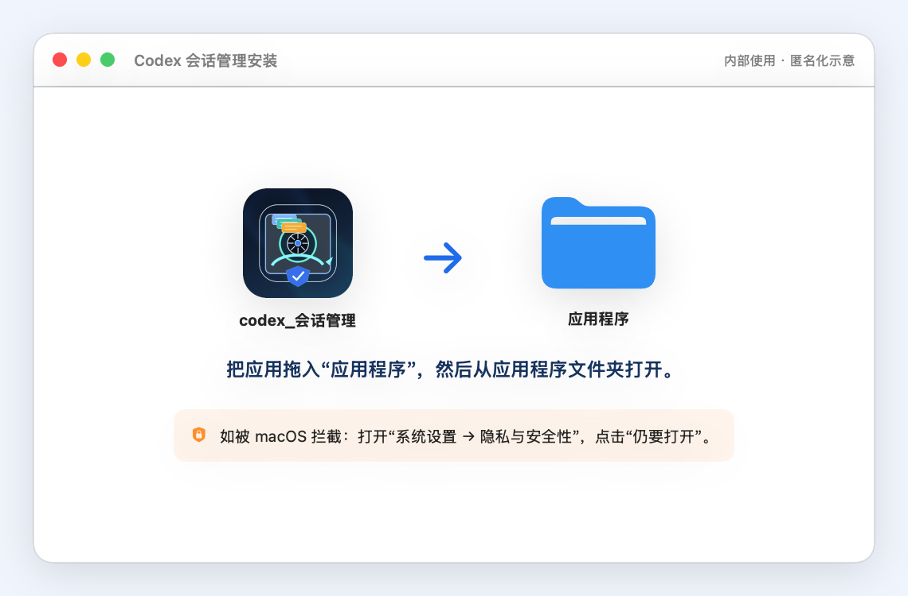
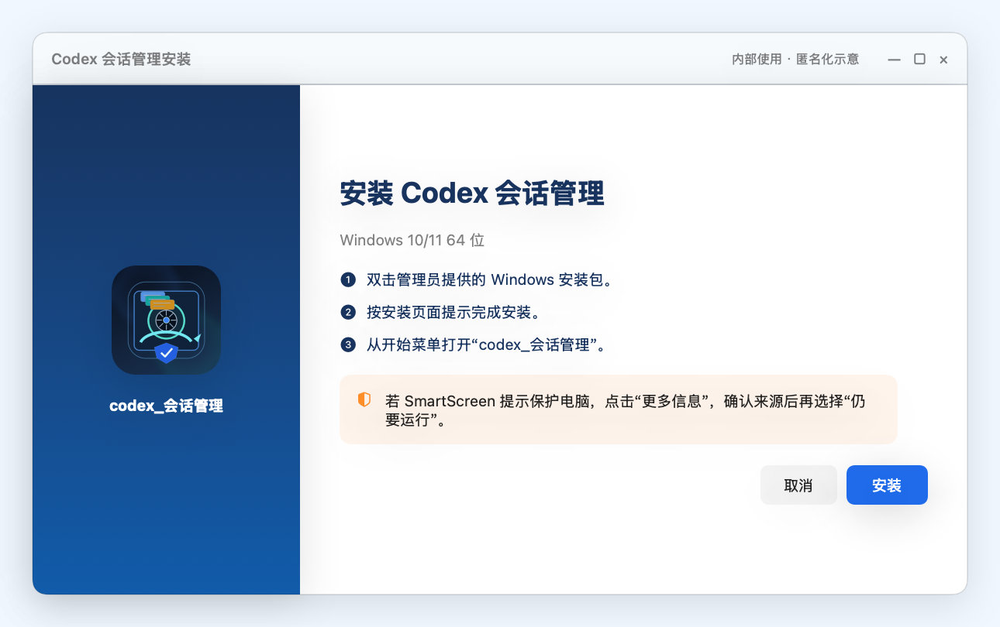
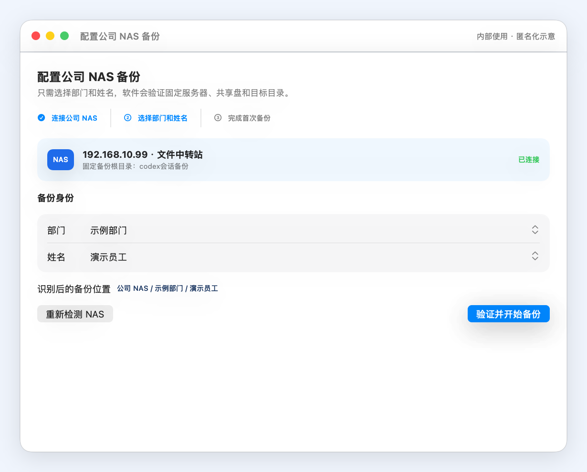
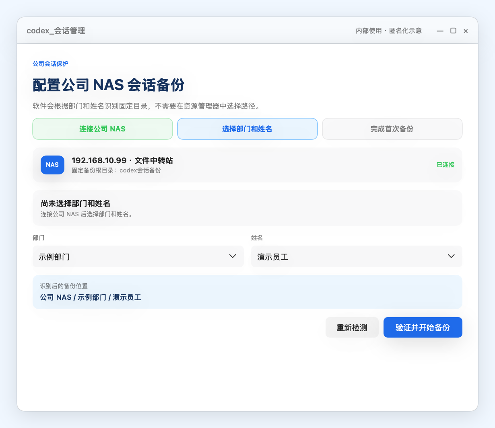
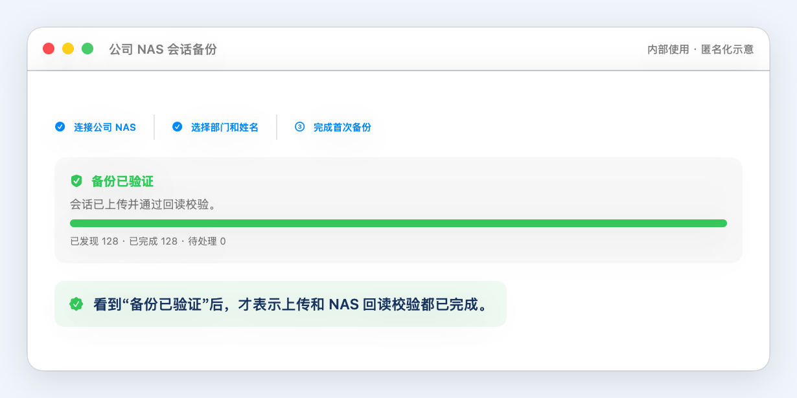

# Codex 会话管理：安装与使用说明

本软件会把 Codex 会话持续备份到公司 NAS，并在上传后回读校验。首次使用只需连接 NAS、选择部门和姓名，不要手工选择备份目录。

内部资料，更新日期：2026-07-18。本文图片为按 1.0.14 最终界面标签制作的匿名示意图，使用示例部门和演示员工；不同系统版本的安全提示外观可能略有差异。

## 1. 选择正确版本

- Apple Silicon（M 系列）Mac 下载管理员提供的 macOS DMG 安装包；Intel Mac 暂不适用。
- Windows 10/11 64 位电脑下载管理员提供的 Windows EXE 安装包。
- 普通员工不需要打开 `安装包校验信息.txt`；该文件仅供管理员核对安装包。

## 2. 安装与首次启动

### macOS

1. 打开 DMG，把“codex_会话管理”拖到“应用程序”。
2. 如果 macOS 拦截，打开“系统设置 → 隐私与安全性”，在拦截提示旁点击“仍要打开”，再确认一次。

### Windows

1. 双击 EXE 安装包，按页面提示安装。
2. 如果 SmartScreen 提示保护电脑，先点“更多信息”，再点“仍要运行”。

## 3. 连接 NAS 并确认身份

1. 先在 Finder 或资源管理器连接服务器 `192.168.10.99` 上的“文件中转站”共享盘。
2. 软件显示“已连接”后，先选部门，再选本人姓名。
3. 确认页面的部门和姓名，点击“验证并开始备份”。不要在 Finder 或资源管理器中自行改名、移动或创建个人备份目录。

## 4. 判断备份是否成功

首次备份会依次显示“正在验证备份目录”“正在进行首次备份”和“正在确认 NAS 文件完整”。在此期间保持 NAS 连接，暂勿退出软件。

只有“备份已验证”表示上传和 NAS 回读校验都已成功。“有会话等待补传”表示软件会继续补传；“备份出现异常”时先点“重新检测”。

## 5. 恢复会话与常见问题

### 更换电脑或会话丢失

打开“快照恢复”。在“恢复来源”中选择“备份恢复”（macOS）或“NAS 备份恢复”（Windows），选择“NAS 备份设备”，再选择状态为“可恢复”的缺失会话，点击“恢复这个缺失会话”或“恢复选中”。恢复完成后重启 Codex。全新电脑没有旧的 Codex 目录也可以恢复；软件会在写入前校验备份完整性。

### NAS 断开

重新连接“文件中转站”，回到软件点击“重新检测 NAS”（配置页）或“重新检测”（状态卡）。仍失败时打开“查看错误详情”，确认画面中没有账号、用户名或本机路径后再截图联系管理员。不要手动删除备份文件。

### 部门或姓名选错

打开右上角“使用帮助”，选择“重新配置部门和姓名”。只能选择 NAS 已存在的部门和员工目录。

### 退出软件

软件需要常驻才能持续备份。Windows 关闭窗口只会隐藏到托盘，需要退出时从托盘菜单选择“退出”；macOS 使用系统应用菜单中的退出命令。首次备份尚未完成时，按页面提示确认。
